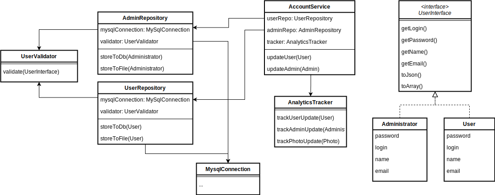

## Agenda
У нашому гіпотетичному проєкті є сервіс для роботи з обліковими даними користувача. Він відповідає за зміну даних користувачів та адміністраторів, а також трекінг таких змін до аналітичної системи.

Сервіс був спроєктований давно, спочатку він записував дані лише в БД, потім виникла потреба записувати дані у файл для тестів (і її додали), а потім ми почали записувати в аналітику зміни й інших сутностей.

Зараз стало очевидно, що за такої структури та схеми додавання функціонала, подальший розвиток сервісу буде важко. Тому варто перепроєктувати класи і залежності для можливості легко розширювати рішення.

## ToDo:
Провести аналіз діаграми класів рішення, дати рекомендації, як спроєктувати його легшим для розширення та підтримки.

### Уточнення
- Можна відштовхуватися від принципів SOLID
- Якщо у вашому рішенні будуть використовуватися схеми, використовуйте будь-який зручний формат (навіть фото блокнота:)
- Не варто вказувати більше функціоналу та деталей реалізації, ніж вже є на діаграмі

### Поточне рішення
Діаграма класів:

