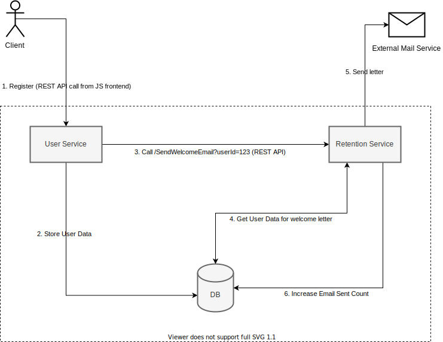

## Agenda
Наш гіпотетичний проєкт - навантажений моноліт, який містить в собі багато бізнес-логіки.
Для отримання можливості масштабувати продукт та команду розробки, було прийнято рішення мігрувати з монолітної архітектури на мікросервісну.
Першим кроком будемо виділяти сервіс обробки користувацьких даних (User Service) та сервіс, який відповідає за повернення користувачів на продукт (Retention Service) шляхом відправки поштових та інших повідомлень.

Один з розробників виявив ініціативу та запропонував свій варіант такого розділення. Свій дизайн він показав на прикладі кейса відправки e-mail "Welcome Letter" при реєстрації користувача на продукті.

## ToDo:
Провести аналіз дизайну, який запропонував розробник

### Уточнення
- Аналіз можна провести вказавши мінуси прийнятих розробником рішень та запропонувавши своє рішення задачі.
- Якщо у вашому рішенні будуть використовуватися схеми, використовуйте будь-який зручний формат (навіть фото блокнота:)

### Задача, які розвʼязуємо
- Розділити моноліт на два мікросервіси: дані користувача (User Service) і відправка листів (Retention Service)
- Показати, як за такого поділу взаємодіятимуть сервіси, на прикладі завдання надсилання листа користувачеві після його реєстрації на сайті

### Додаткові дані
- Користувач реєструється через User Service та заповнює інформацію про себе
- Для формування листа, сервісу Retention Service потрібна лише певна частина даних з інформації про користувача
- Інформація про кількість надісланих користувачеві листів має бути збережена для подальшого використання в User Service
- Retention Service розвиватиметься окремою командою та включатиме різні логіки повідомлень

### Розвʼязок розробника
Схема взаємодії:



Опис розв'язку:

Запропоновано використовувати два сервіси та одну загальну базу даних. Спілкування між сервісами здійснюється за протоколом REST API.
Схема взаємодій сервісів при надсиланні листа користувачу:
1. Користувач реєструється, надсилаючи запит REST API на User Service (US)
2. US валідує та зберігає дані користувача в DB
3. US відправляє REST API запит (GET) на Retention Service (RS) за адресою ```/SendWelcomeEmail?userId=123```
4. RS читає потрібні дані користувача з DB, формує лист
5. RS відправляє сформований лист через сторонній сервіс надсилання пошти
6. RS збільшує лічильник кількості надісланих користувачеві листів у DB
